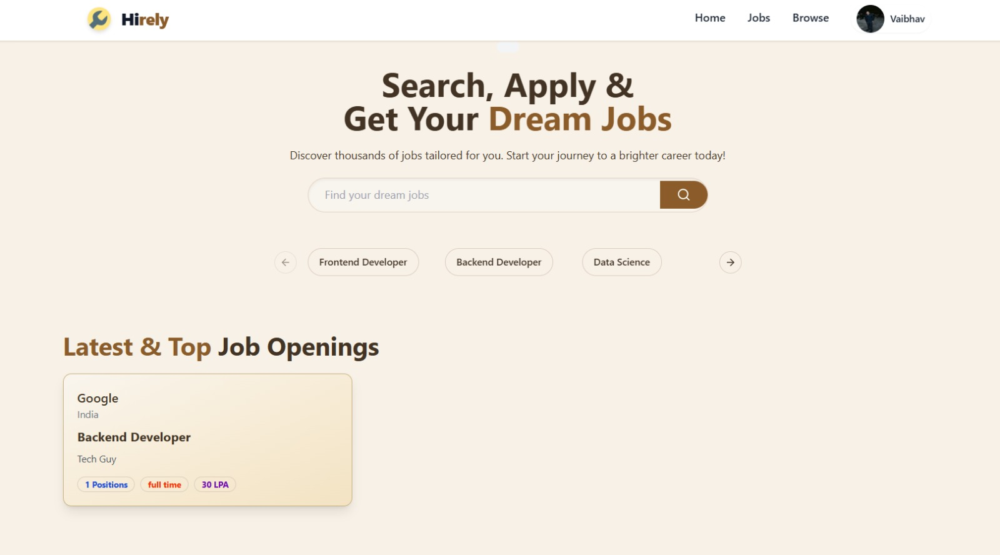
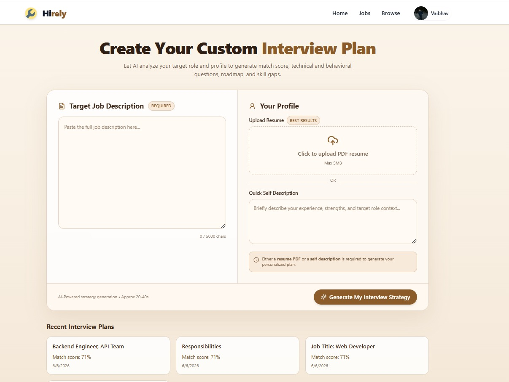

# Hirely

Hirely is a full-stack job portal for job seekers and recruiters. It includes job browsing, applications, profile management, company setup, admin tools, and an AI-powered interview plan feature.

## Live Demo

- Production App: https://hirely-job-iota.vercel.app/

## Screenshots

### Login Page


### Interview Plan


## Features

### For Job Seekers
- Browse and search jobs
- Apply to jobs quickly
- Manage profile and resume
- Track applied jobs
- Generate AI-based interview plans

### For Recruiters
- Create and manage companies
- Post and edit job listings
- View applicants for each job
- Manage hiring workflow

### Admin Features
- Admin dashboard support
- Company management
- Job management
- Applicant overview

## Tech Stack

### Frontend
- React
- Vite
- Tailwind CSS
- Redux Toolkit
- React Router
- Shadcn UI
- Sonner

### Backend
- Node.js
- Express.js
- MongoDB
- Mongoose
- JWT Authentication
- Cloudinary
- Multer
- Google Gemini API

## Project Structure

```bash
Hirely/
├── frontend/
│   ├── src/
│   ├── public/
│   └── package.json
├── backend/
│   ├── controllers/
│   ├── models/
│   ├── routes/
│   ├── middlewares/
│   └── package.json
└── README.md
```

## Local Setup

### Prerequisites
- Node.js
- MongoDB Atlas or local MongoDB
- npm

### Backend

```bash
cd backend
npm install
```

Create a `.env` file inside `backend/`:

```env
PORT=3000
MONGO_URI=your_mongodb_uri
SECRET_KEY=your_jwt_secret
CLOUD_NAME=your_cloudinary_cloud_name
API_KEY=your_cloudinary_api_key
API_SECRET=your_cloudinary_api_secret
GOOGLE_GEN_API_KEY=your_google_gemini_api_key
```

Start backend:

```bash
npm start
```

### Frontend

```bash
cd frontend
npm install
```

Create a `.env.local` file inside `frontend/`:

```env
VITE_API_URL=http://localhost:3000
```

Start frontend:

```bash
npm run dev
```

## Deployment

### Render Backend

1. Create a new Render Web Service from the `backend` folder.
2. Build Command: `npm install`
3. Start Command: `npm start`
4. Add environment variables:

```env
NODE_ENV=production
PORT=10000
MONGO_URI=your_mongodb_uri
SECRET_KEY=your_jwt_secret
CLIENT_URL=https://hirely-job-iota.vercel.app
CLOUD_NAME=your_cloudinary_cloud_name
API_KEY=your_cloudinary_api_key
API_SECRET=your_cloudinary_api_secret
GOOGLE_GEN_API_KEY=your_google_gemini_api_key
```

### Vercel Frontend

1. Create a new Vercel project from the `frontend` folder.
2. Framework preset: `Vite`
3. Build Command: `npm run build`
4. Output Directory: `dist`
5. Add environment variable:

```env
VITE_API_URL=https://your-render-backend-url.onrender.com
```

## API Routes

### Authentication
- `POST /api/v1/user/register`
- `POST /api/v1/user/login`
- `GET /api/v1/user/profile`
- `PUT /api/v1/user/profile`

### Jobs
- `GET /api/v1/job`
- `GET /api/v1/job/:id`
- `POST /api/v1/job`
- `PUT /api/v1/job/:id`
- `DELETE /api/v1/job/:id`

### Applications
- `POST /api/v1/application/apply`
- `GET /api/v1/application`
- `GET /api/v1/application/:id/applicants`

### Companies
- `GET /api/v1/company`
- `GET /api/v1/company/:id`
- `POST /api/v1/company/register`
- `PUT /api/v1/company/:id`

### Interview Plans
- `GET /api/v1/interview/plans`
- `POST /api/v1/interview/plan`
- `GET /api/v1/interview/plan/:id`

## Notes

- Authentication uses HTTP-only cookies.
- Production frontend and backend are hosted separately on Vercel and Render.
- Make sure `CLIENT_URL` and `VITE_API_URL` point to the exact deployed domains.

## License

This project is open source and available under the MIT License.

## Author

Made with ❤️ by Karun
